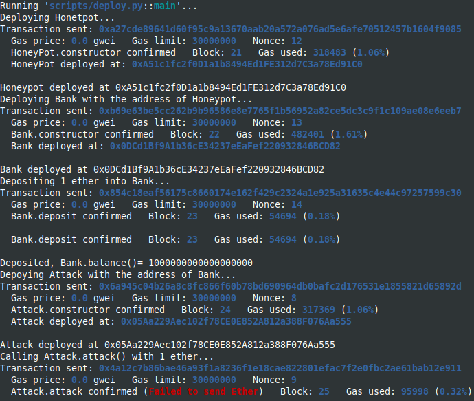
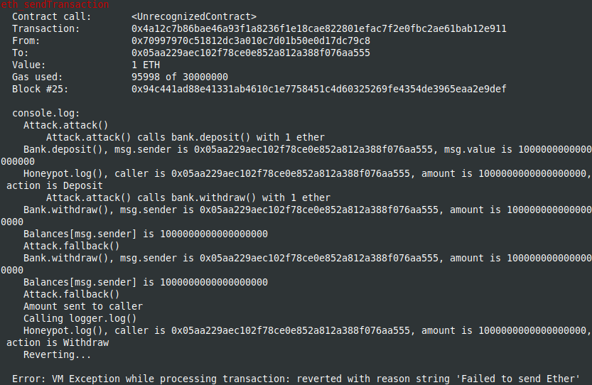

Study case of Honeypot hack, from Solidity by example site [Solidity by Example, honeypot](https://solidity-by-example.org/hacks/honeypot/)

I use brownie to compile and deploy into hardhat in order to have the console.log feature.
You should start the hardhat node in another terminal and folder (`hh node`), then, in a terminal :

```
brownie compile
brownie run scripts/deploy.py
```

After deploying from brownie :


The result in the hardhat console :


